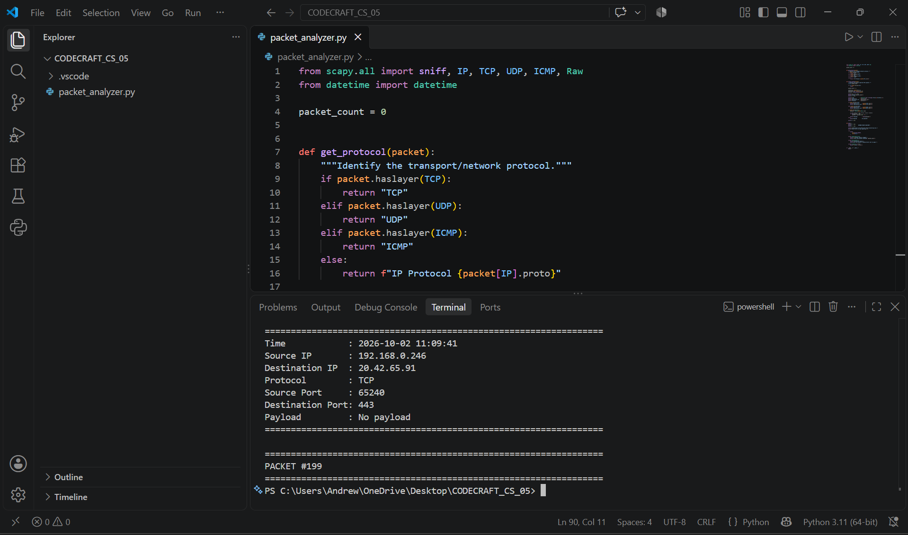
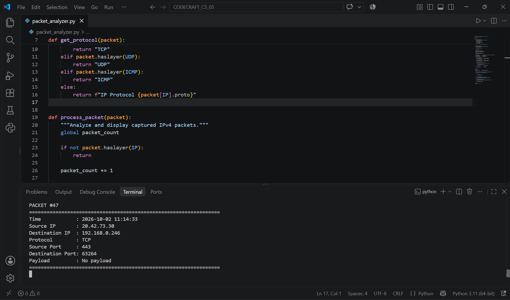
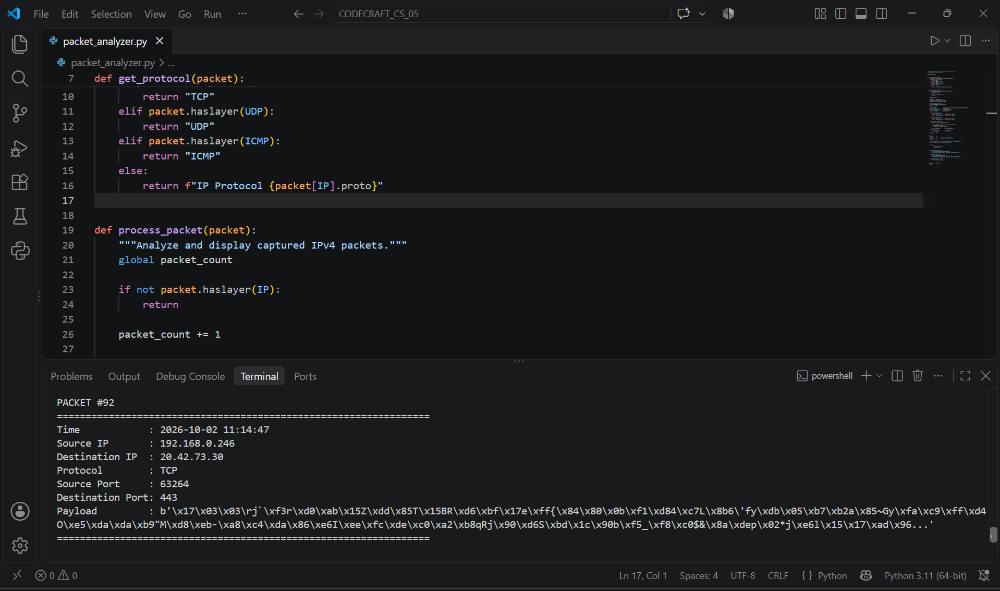

# Packet Analyzer

A Python-based packet analyzer developed as **Task 05** of the **CodeCraft InfoTech Cyber Security Internship**.

The tool captures and analyzes live IPv4 network packets using Scapy and displays important packet information such as source and destination IP addresses, protocols, ports, and payload data.

## Features

- Captures live IPv4 network traffic
- Displays source and destination IP addresses
- Identifies TCP, UDP, and ICMP protocols
- Displays TCP/UDP source and destination ports
- Displays packet payload when available
- Limits payload output for better readability
- Counts captured packets
- Supports continuous capture until stopped by the user

## Technologies Used

- Python 3
- Scapy
- Npcap
- TCP/IP
- Network Packet Analysis

## Project Structure

```text
CODECRAFT_CS_05/
├── packet_analyzer.py
├── README.md
├── requirements.txt
├── .gitignore
└── screenshots/
    ├── 01_packet_capture.png
    ├── 02_packet_details.png
    └── 03_payload_capture.png
```

## Installation

Clone the repository:

```bash
git clone https://github.com/Andrewleo20/CODECRAFT_CS_05.git
cd CODECRAFT_CS_05
```

Install the Python dependency:

```bash
pip install -r requirements.txt
```

### Windows Requirement

Npcap is required for packet capture on Windows.

After installing Npcap, administrator privileges may be required to capture network traffic.

## Usage

Run:

```bash
python packet_analyzer.py
```

Press `Ctrl+C` to stop packet capture.

## Example Output

```text
PACKET #92
=================================================================
Time            : 2026-10-02 11:14:47
Source IP       : 192.168.x.x
Destination IP  : x.x.x.x
Protocol        : TCP
Source Port     : 63264
Destination Port: 443
Payload         : b'...'
=================================================================
```

## Screenshots

### Packet Capture



### Packet Details



### Payload Capture



## What I Learned

Through this project, I gained hands-on experience with:

- Network packet capture and analysis
- TCP/IP communication
- TCP, UDP, and ICMP protocol identification
- Source and destination IP analysis
- Port analysis
- Packet payload inspection
- Python-based network security tooling

## Ethical Use

This project is intended strictly for **educational and authorized network analysis**.

Only capture or analyze network traffic on systems and networks that you own or have explicit permission to monitor. Unauthorized packet interception may violate privacy, organizational policies, or applicable laws.

## Internship

**CodeCraft InfoTech — Cyber Security Internship**

**Task 05: Packet Analyzer**
